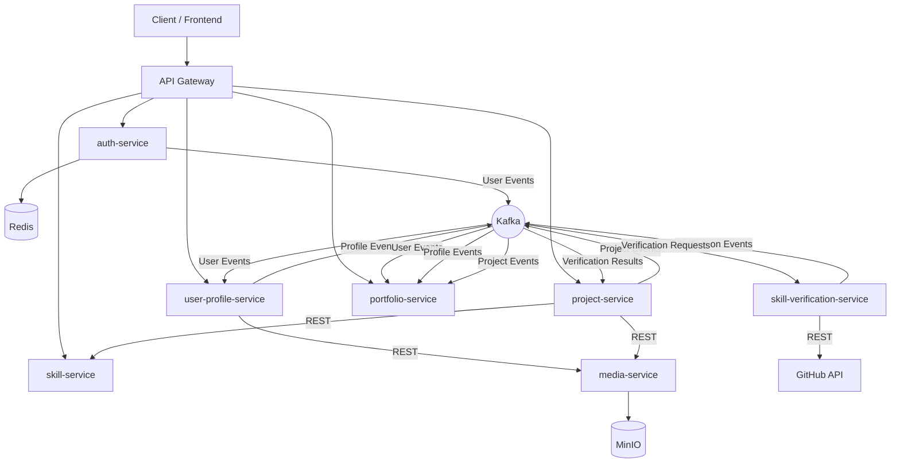

# Devfolio

## Кратко

Devfolio - микросервисная платформа для создания IT-портфолио с автоматической верификацией навыков
через анализ GitHub-репозиториев.

Стек: Java, Spring Boot, Kafka, PostgreSQL, Redis, MinIO.

Архитектура: Microservices + Event-Driven + Outbox + Debezium.

## О проекте

Devfolio - серверная часть онлайн-платформы для создания и управления профессиональными IT-портфолио,
построенная на основе микросервисной архитектуры.

Платформа позволяет разработчикам создавать профессиональные профили, публиковать проекты,
управлять навыками, формировать единое портфолио и демонстрировать свой опыт потенциальным работодателям.

Ключевой особенностью системы является автоматическая верификация навыков на основе анализа исходного
кода GitHub-репозиториев. При проверке система анализириует содержимое репозитория и подтверждает
использование заявленных технологий в проекте.

Проект разработан в рамках дипломной работы по теме:

«Разработка серверной части онлайн-платформы для IT-портфолио»

---

## Ключевые возможности

### Управление профилем

- регистрация и авторизация пользователей;
- редактирование профиля разработчика;
- загрузка и удаление аватара;
- управление карьерной историей;
- хранение информации об образовании и опыте работы.

### Управление проектами

- создание, редактирование и удаление проектов;
- загрузка превью проекта;
- загрузка дополнительных изображений проекта;
- указание GitHub-репозитория проекта;
- поиск проектов по названию;
- фильтрация проектов по навыкам и категориям навыков;
- сортировка по популярности, просмотрам и дате создания.

### Работа с навыками

- централизованный каталог навыков;
- поддержка категорий:
    - LANGUAGE;
    - FRAMEWORK;
    - TOOL;
    - PLATFORM;
- управление навыками через административный интерфейс;
- активация и деактивация навыков.

### Автоматическая верификация навыков

Пользователь может указать GitHub-репозиторий проекта и запустить процесс проверки навыков.

В процессе верификации система:
- получает содержимое репозитория через GitHub API;
- анализирует структуру проекта;
- проверяет наличие используемых технологий;
- подтверждает или отклоняет заявленные навыки.

Поддерживается определение следующих технологий:

#### Языки программирования

- Java
- JavaScript
- TypeScript
- Python
- Go

#### Фреймворки

- Spring
- Spring Boot
- Spring Security
- Hibernate
- Express
- NestJS
- Django
- Flask

#### Платформы и инструменты

- Docker
- Kafka
- PostgreSQL
- MySQL
- Redis
- Lombok
- MapStruct
- Testing

### Формирование портфолио

- автоматическая агрегация данных пользователя;
- объединение профиля, проектов и карьерной информации;
- отображение статуса верификации навыков;
- получение готового представления портфолио через единый API.

### Социальные возможности

- добавление проектов в избранное;
- система лайков;
- счетчик просмотров проектов.

---

## Архитектурные особенности

Проект построен на основе следующих архитектурных подходов:
- Microservices Architecture;
- Event-Driven Architecture;
- Database per Service;
- API Gateway Pattern;
- Outbox Pattern;
- Change Data Capture (CDC);
- Idempotent Consumers.

## Взаимодействие сервисов

В системе используются два способа взаимодействия между микросервисами:

### Синхронное взаимодействие

Для операций типа Request-Response используется REST API.

Примеры:
- проверка существования навыка;
- загрузка и удаление файлов;
- получение данных между сервисами.

### Асинхронное взаимодействие 

Для обмена событиями используется Kafka.

Передача событий реализована через связку:

PostgreSQL → Outbox Table → Debezium → Kafka

Такой подход позволяет гарантировать надежную публикацию событий и избежать проблем двойной записи
данных (Dual Write Problem).

Все потребители реализованы как идемпотентные обработчики.

---

## Архитектура системы

Система построена на микросервисной архитектуре с использованием API Gateway и асинхронного 
взаимодействия через Kafka.



---

## Event-Driven взаимодействие

Для передачи доменных событий используется Apache Kafka.

События публикуются через механизм Outbox Pattern и Debezium CDC.

Основные события системы:

### User Events
- UserCreatedEvent
- UserDeletedEvent
- UserProfileUpdatedEvent
- UserProfileAvatarUpdatedEvent
- UserProfileCareerUpdatedEvent

### Project Events
- ProjectCreatedEvent
- ProjectUpdatedEvent
- ProjectDeletedEvent
- ProjectPreviewUpdatedEvent

### Skill Events
- ProjectSkillAddedEvent
- ProjectSkillRemovedEvent
- ProjectSkillsUpdatedEvent

### Verification Events
- ProjectSkillVerificationRequestedEvent
- ProjectSkillVerificationCompletedEvent

Данные события используются для синхронизации агрегированной модели портфолио и организации процесса
верификации навыков.

## Микросервисы

Система состоит из нескольких независимых сервисов, каждый из которых отвечает за свою предметную область.

| Сервис | Назначение |
|---------|---------|
| auth-service | Регистрация, авторизация, JWT Access/Refresh токены, управление сессиями (Redis) |
| gateway-service | Единая точка входа, маршрутизация запросов, проверка JWT |
| user-profile-service | Управление профилями пользователей, карьерой и аватарами |
| project-service | Управление проектами, навыками в проектах, лайками, избранным и просмотрами |
| skill-service | Централизованный каталог навыков и их управление (ADMIN-only) |
| skill-verification-service | Автоматическая верификация навыков через анализ GitHub репозиториев |
| media-service | Загрузка и хранение файлов (MinIO), выдача URL на изображения |
| portfolio-service | Агрегация данных профиля, проектов и навыков в единую read-модель |

## Технологический стек

Проект реализован с использованием современного Java/Spring стека и распределённой архитектуры.

### Backend

- Java 17
- Spring Boot
- Spring Security
- Spring Data JPA
- Hibernate
- Lombok
- MapStruct

### Архитектура и интеграции

- Microservices Architecture
- API Gateway (Spring Cloud Gateway)
- Event-Driven Architecture
- Apache Kafka
- Debezium (CDC)
- Outbox Pattern
- REST API (synchronous communication)

### Хранилища данных

- PostgreSQL (основные данные сервисов)
- Redis (хранение refresh токенов)
- MinIO (объектное хранилище файлов)

### Интеграции

- GitHub REST API (анализ репозиториев для верификации навыков)

### Тестирование

- JUnit 5
- Testcontainers
- WireMock
- Integration Testing (до 70–80% покрытия)

### Инфраструктура

- Docker
- Docker Compose

### CI/CD

- GitHub Actions (build, test, docker image build, docker image push)

## Структура репозитория

Проект реализован как монорепозиторий, включающий все микросервисы и общие модули.

```text
devfolio
│
├── auth-service
├── gateway-service
├── media-service
├── portfolio-service
├── project-service
├── skill-service
├── skill-verification-service
├── user-profile-service
│
├── common-events              # Общие Kafka-события (контракты)
├── jwt-security-starter       # Переиспользуемый Spring Boot Starter для JWT
│
├── infrastructure
│   └── kafka
│       └── debezium          # Конфигурации CDC-коннекторов и скрипты
│
├── .github
│   └── workflows             # CI/CD pipelines (GitHub Actions)
│
├── docker-compose.yml        # Поднятие всей инфраструктуры
├── .env.example              # Пример переменных окружения
└── pom.xml                   # Root Maven multi-module проект
```

## Запуск проекта

Проект полностью контейнеризирован и может быть запущен через Docker Compose.

### Требования

Перед запуском убедитесь, что установлены:

- Docker
- Docker Compose

---

### Подготовка окружения

Скопируйте пример переменных окружения:

```bash
cp .env.example .env
```

---

### Запуск инфраструктуры

Сначала запустите всю систему:

```bash
docker-compose up -d
```

---

### Регистрация Debezium коннекторов

После поднятия Kafka и инфраструктуры необходимо зарегистрировать Debezium коннекторы:

```bash
cd infrastructure/kafka/debezium
sh register-connectors.sh
```

Этот скрипт автоматически создает и регистрирует необходимые CDC-коннекторы для Outbox таблиц всех
сервисов.

---

### Проверка запуска

После успешного старта будут доступны:
- API Gateway: `http://localhost:8080`
- Swagger UI (через Gateway): `http://localhost:8080/webjars/swagger-ui`

### Остановка системы

```bash
docker compose down
```

--- 

## API документация (Swagger)

Все API доступны через единый API Gateway с централизованной Swagger UI.

### Доступ к Swagger UI

`http://localhost:8080/webjars/swagger-ui`

### Аутентификация

Для выполнения защищённых запросов:

1. Получите JWT токен через auth-service;
2. Нажмите кнопку "Authorize" в Swagger UI;
3. Вставьте токен в формате:

`Bearer <access_token>`

---

## Тестирование

Проект покрыт автоматизированными тестами на разных уровнях: unit и integration.

Основной упор сделан на интеграционное тестирование микросервисов.

---

### Используемые инструменты

- JUnit 5 - unit и integration тесты;
- Testcontainers - поднятие реальных зависимостей (PostgreSQL, Redis, Kafka);
- WireMock - мокирование внешних HTTP-зависимостей (включая GitHub API);
- Spring Boot Test - тестирование Spring контекста.

---

### Подход к тестированию

- Интеграционные тесты используются для проверки критических бизнес-сценариев;
- Контейнеры поднимаются автоматически через Testcontainers;
- Внешние API (например, GitHub API) эмулируются через WireMock;
- Основной фокус - проверка взаимодействия между слоями и сервисами.

---

### Покрытие

- Общий уровень покрытия: ~70–80%.

---

## CI/CD

Pipeline включает: build → test → docker build → push images